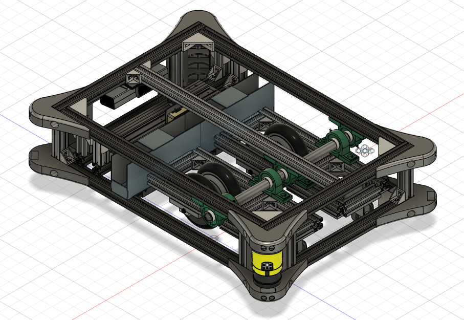

# FTS

Für den Aktuellen Fahrnode fts_drive wird es in kürze einen Neuen Node geben der eigenständig [hier](https://github.com/Techbeard/hover)
 verfügbar ist.

## Verwendete Firmeware für die Antriebe 

https://github.com/EmanuelFeru/hoverboard-firmware-hack-FOC

## benötigte Nodes

https://github.com/ipa320/cob_driver/tree/kinetic_dev/cob_sick_s300

## Verschiedene Fahrversuche und ähnliches

https://twitter.com/TheVale98/status/1109271786888355840?s=20

